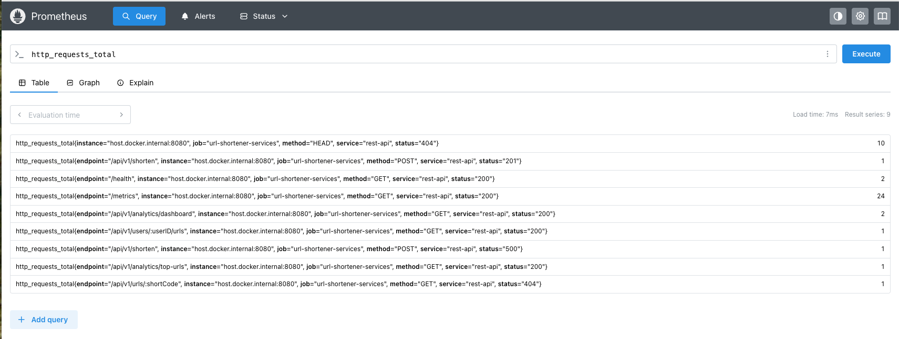
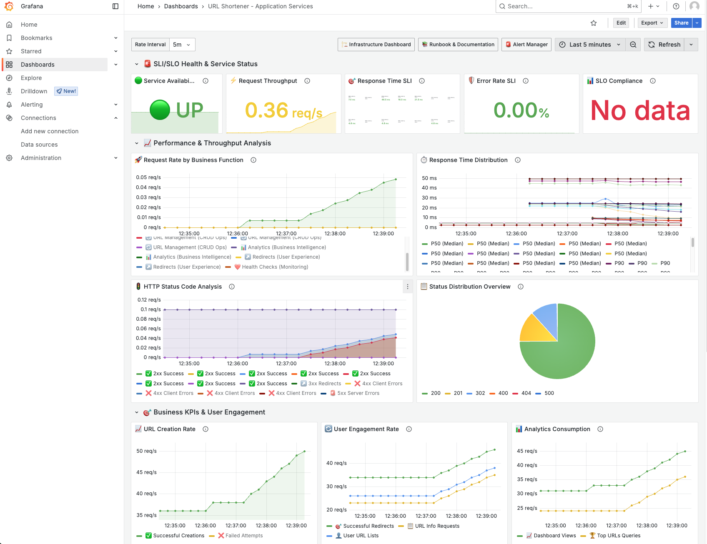
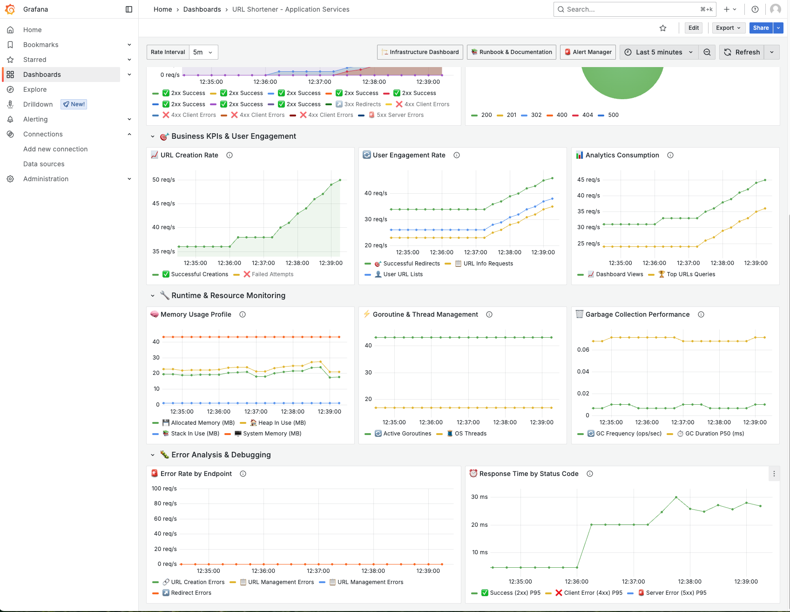
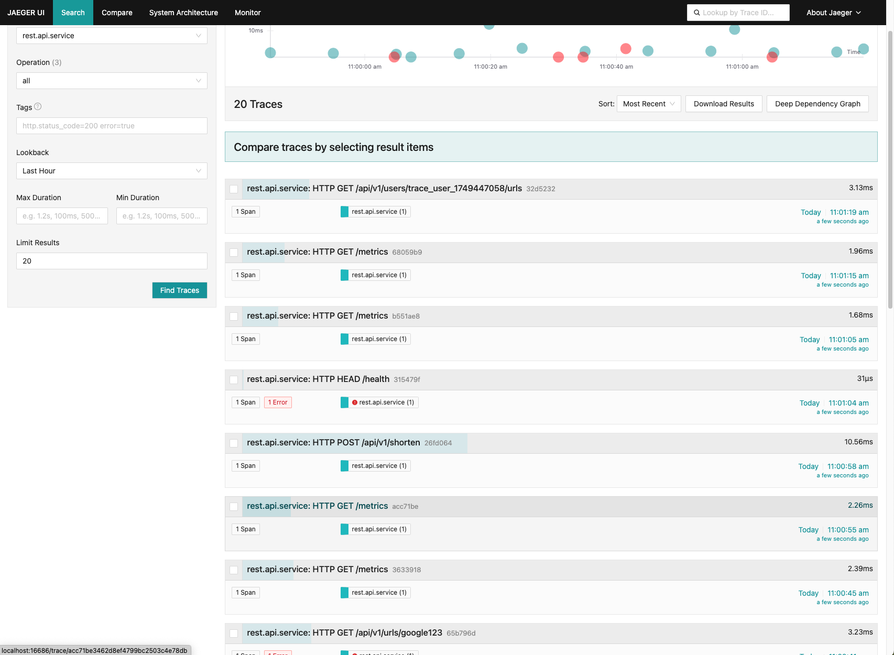

# URL Shortener - Production-Ready Microservices Implementation

[](https://golang.org/)
[](https://go-micro.dev/)
[](https://nats.io/)
[](https://postgresql.org/)
[](https://redis.io/)
[](https://clickhouse.com/)
[](https://docker.com/)
[](https://prometheus.io/)
[](https://grafana.com/)
[](https://jaegertracing.io/)

## 📋 Table of Contents

- [🎯 Project Overview](#-project-overview)
- [🏗️ System Architecture](#️-system-architecture)
- [✨ Key Features](#-key-features)
- [🚀 Quick Start](#-quick-start)
- [📖 API Documentation](#-api-documentation)
- [🔧 Development Guide](#-development-guide)
- [📊 Monitoring & Observability](#-monitoring--observability)

## 🎯 Project Overview

A **production-ready URL shortener** built with **Go Micro v5 microservices architecture**, demonstrating modern software engineering practices and comprehensive observability. This project serves as a reference implementation for building scalable, maintainable microservices systems in Go.

### 🎪 **Live Demo & Testing**

| Component | Access Point | Description |
|-----------|--------------|-------------|
| **🌐 REST API** | `http://localhost:8080` | Main API gateway |
| **📖 Interactive Swagger UI** | `http://localhost:8080/docs/index.html` | Try APIs in browser |
| **🏠 API Documentation** | `http://localhost:8080/` | Beautiful landing page |
| **📊 Prometheus Metrics** | `http://localhost:9090` | Metrics collection |
| **📈 Grafana Dashboards** | `http://localhost:3000` | Visual monitoring |
| **🔍 Jaeger Tracing** | `http://localhost:16686` | Distributed tracing |
| **📊 ClickHouse Analytics** | `http://localhost:8123` | Real-time analytics database |

### 🎯 **Business Value**

- **📈 Scalability**: Horizontal scaling via microservices architecture
- **⚡ Performance**: Redis caching with 95%+ cache hit ratio
- **🔍 Observability**: Complete monitoring stack with Prometheus, Grafana, and Jaeger
- **📊 Analytics**: Real-time click tracking with ClickHouse time-series storage
- **🛡️ Reliability**: Production-ready patterns with circuit breakers and health checks
- **🚀 Developer Experience**: Interactive API documentation and comprehensive testing

## 🏗️ System Architecture

> **Note**: Architecture diagram will be added here

### 🔄 **Service Communication Flow**

```
External Client → REST API → NATS Discovery → RPC Services → Database/Cache
     ↓              ↓             ↓              ↓              ↓
HTTP Request → gRPC Client → NATS Transport → gRPC Handler → Business Logic
```

### 🏗️ **Microservices Overview**

| Service | Port | Responsibility | Technology Stack |
|---------|------|----------------|------------------|
| **REST API Service** | 8080 | HTTP gateway, API documentation | Gin, Swagger, NATS discovery |
| **URL Shortener RPC** | 50051 | Core business logic | Go Micro, Protocol Buffers |
| **Analytics Service** | 50052 | Real-time analytics processing | ClickHouse, NATS events |
| **Redirect Service** | 50053 | URL resolution, click tracking | Go Micro, Redis cache |

### 🗄️ **Data Layer Architecture**

- **PostgreSQL**: Primary data store with optimized indexes
- **Redis**: High-performance caching layer
- **ClickHouse**: Time-series analytics storage
- **NATS**: Service discovery, transport, and event streaming

## ✨ Key Features

### 🎯 **Core Functionality**
- ✅ **URL Shortening** with custom algorithms and validation
- ✅ **Custom Aliases** for branded short links
- ✅ **User Management** with personal URL collections
- ✅ **Expiration Handling** with automatic cleanup
- ✅ **Click Tracking** with real-time analytics
- ✅ **Cache-First Strategy** for sub-millisecond redirects

### 📊 **Analytics & Monitoring**
- ✅ **Real-time Click Analytics** with ClickHouse
- ✅ **Business KPI Dashboards** in Grafana
- ✅ **Distributed Tracing** with Jaeger
- ✅ **Prometheus Metrics** for all services

## 🚀 Quick Start

### 📋 **Prerequisites**
- **Go 1.23+**
- **Docker & Docker Compose**
- **Protocol Buffers compiler** (`protoc`)
- **Make** (for automation)

### ⚡ **One-Command Setup**
```bash
# Complete setup and run
make setup && make run-all
```

### 🔧 **Step-by-Step Setup**

#### 1️⃣ **Clone and Install Dependencies**
```bash
git clone https://github.com/go-systems-lab/go-url-shortener.git
cd go-url-shortener
make deps
```

#### 2️⃣ **Generate Code and Documentation**
```bash
make proto    # Generate Protocol Buffers
make swagger  # Generate API documentation
```

#### 3️⃣ **Start Infrastructure**
```bash
make dev-up        # PostgreSQL + Redis + ClickHouse
make setup-nats    # NATS server
```

#### 4️⃣ **Build and Run Services**
```bash
make build-all

# Terminal 1: RPC Service
make run-rpc

# Terminal 2: Redirect Service  
make run-redirect

# Terminal 3: REST API Service
PORT=8080 make run-rest

# Terminal 4: Analytics Service
make run-analytics
```

#### 5️⃣ **Start Monitoring Stack**
```bash
make start-monitoring  # Prometheus + Grafana + Jaeger
```

### 🎉 **Verification**
```bash
# Test API health
make health

# Run comprehensive API tests
make test-api

# Open interactive documentation
make demo-swagger
```

## 📖 API Documentation

### 🌟 **Interactive Swagger UI**

Our REST API includes **comprehensive OpenAPI 3.0 documentation** with interactive testing capabilities.

#### **📱 Access Points**
- **🔗 Swagger UI**: `http://localhost:8080/docs/index.html`
- **📄 OpenAPI Spec**: `http://localhost:8080/docs/doc.json`
- **🏠 Landing Page**: `http://localhost:8080/`

#### **🎯 Core Endpoints**

| Method | Endpoint | Description | Example |
|--------|----------|-------------|---------|
| `POST` | `/api/v1/shorten` | Create short URL | [Try it →](http://localhost:8080/docs/index.html) |
| `GET` | `/api/v1/urls/{shortCode}` | Get URL info | [Try it →](http://localhost:8080/docs/index.html) |
| `GET` | `/{shortCode}` | Redirect to long URL | Direct browser access |
| `GET` | `/api/v1/users/{userID}/urls` | List user URLs | [Try it →](http://localhost:8080/docs/index.html) |
| `DELETE` | `/api/v1/urls/{shortCode}` | Delete URL | [Try it →](http://localhost:8080/docs/index.html) |

#### **📊 Analytics Endpoints**

| Method | Endpoint | Description |
|--------|----------|-------------|
| `GET` | `/api/v1/analytics/dashboard` | System metrics |
| `GET` | `/api/v1/analytics/urls/{shortCode}` | URL-specific analytics |
| `GET` | `/api/v1/analytics/top-urls` | Most popular URLs |

### 🧪 **Quick API Testing**

```bash
# Create a short URL
curl -X POST http://localhost:8080/api/v1/shorten \
  -H "Content-Type: application/json" \
  -d '{
    "long_url": "https://example.com",
    "user_id": "user123",
    "custom_code": "mylink"
  }'

# Test redirect
curl -L http://localhost:8080/mylink

# Get analytics
curl http://localhost:8080/api/v1/analytics/urls/mylink
```

## 🔧 Development Guide

### 🏗️ **Project Structure**

```
go-url-shortener/
├── 📁 services/                 # Microservices
│   ├── 📁 rest-api-svc/        # HTTP gateway
│   ├── 📁 url-shortener-svc/   # Core business logic
│   ├── 📁 redirect-svc/        # URL resolution
│   └── 📁 analytics-svc/       # Real-time analytics
├── 📁 proto/                   # Protocol Buffers
├── 📁 utils/                   # Shared utilities
├── 📁 database/                # Database migrations
├── 📁 infrastructure/          # Docker & configs
├── 📄 Makefile                 # Automation scripts
└── 📄 README.md               # This file
```

### 🛠️ **Development Commands**

```bash
# 🔧 Code Generation
make proto              # Generate Protocol Buffers
make swagger            # Update API documentation

# 🏗️ Building
make build-all          # Build all services
make build-rest         # Build REST API only
make build-rpc          # Build RPC service only

# 🧪 Testing
make test               # Run all tests (26/26)
make test-integration   # Integration tests
make test-api           # API endpoint tests

# 🚀 Running Services
make run-all            # Start all services
make run-rest           # REST API service
make run-rpc            # RPC service
make run-redirect       # Redirect service
make run-analytics      # Analytics service

# 🔍 Monitoring
make logs               # View service logs
make health             # Check service health
make metrics            # View Prometheus metrics
```

### 🔄 **Development Workflow**

1. **Make Changes** to source code
2. **Regenerate** Protocol Buffers: `make proto`
3. **Update** API docs: `make swagger`
4. **Build** services: `make build-all`
5. **Test** changes: `make test`
6. **Run** locally: `make run-all`
7. **Verify** via Swagger UI

## 📊 Monitoring & Observability

Our comprehensive observability stack provides real-time insights into system performance, user behavior, and service health. Experience **enterprise-grade monitoring** with beautiful dashboards and distributed tracing.

### 🚀 **Accessing Monitoring Tools**

```bash
# Start complete monitoring stack
make start-monitoring

# Access dashboards
open http://localhost:9090    # Prometheus
open http://localhost:3000    # Grafana (admin/admin)  
open http://localhost:16686   # Jaeger tracing

# Generate sample data
make generate-traffic
```

### 📈 **Live Monitoring Dashboards**

#### 🎯 **Prometheus Metrics Collection**
Real-time metrics collection and alerting for all microservices with custom business KPIs.

<div align="center">
  
  <p><em>📊 Prometheus metrics showing service health, request rates, and custom business metrics</em></p>
</div>

---

#### 📊 **Grafana Business Intelligence**
Beautiful, interactive dashboards providing insights into system performance and user engagement.

<div align="center">
  
  <p><em>🎛️ System Overview: Service health, response times, and resource utilization</em></p>
</div>

<div align="center">
  
  <p><em>📈 Business KPIs: URL creation rates, click analytics, and user engagement metrics</em></p>
</div>

---

#### 🔍 **Jaeger Distributed Tracing**
End-to-end request tracing across all microservices for performance optimization and debugging.

<div align="center">
  
  <p><em>🕸️ Distributed tracing showing request flow through microservices with timing analysis</em></p>
</div>

---

### 📊 **Key Business Metrics**

| Metric | Description | Dashboard Panel |
|--------|-------------|-----------------|
| **URL Creation Rate** | New URLs created per minute | Business KPIs |
| **Click-Through Rate** | Successful redirects per minute | User Engagement |
| **Cache Hit Ratio** | Redis cache effectiveness | Performance |
| **Error Rate** | Failed requests percentage | Service Health |
| **Response Time** | API latency percentiles | Performance |

⭐ **Star this repository** if you find it helpful!

🔗 **Connect with us**: [GitHub Issues](https://github.com/go-systems-lab/go-url-shortener/issues) | [Discussions](https://github.com/go-systems-lab/go-url-shortener/discussions)

**Made with ❤️ by the Go Systems Lab team**